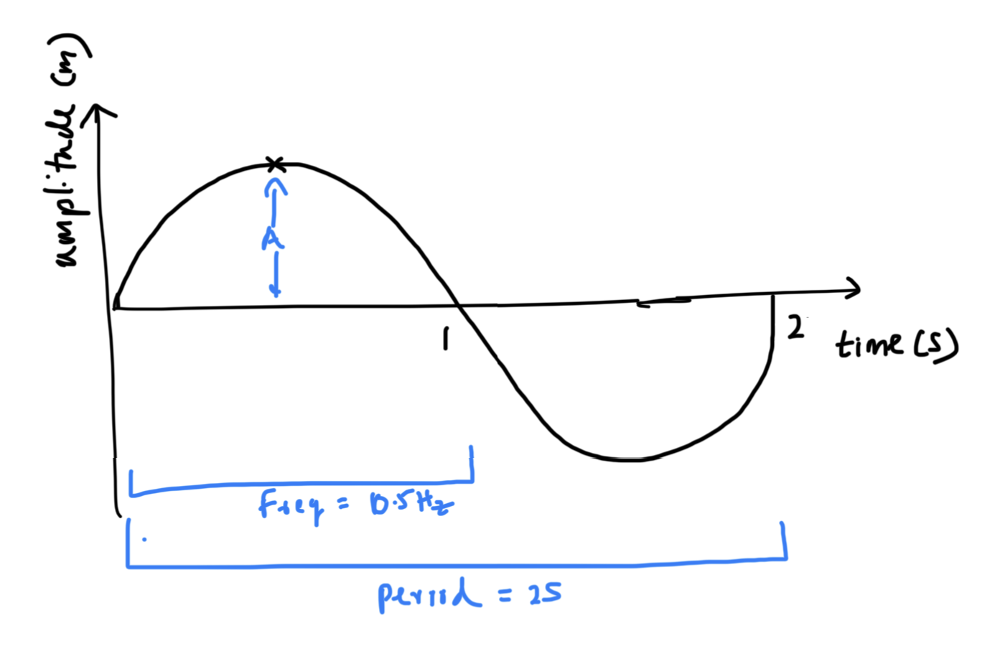
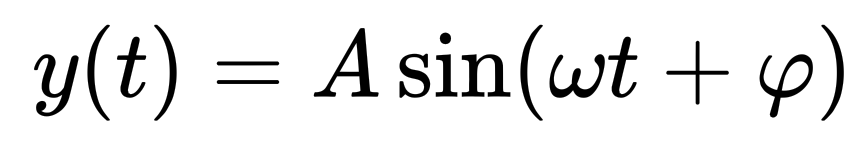
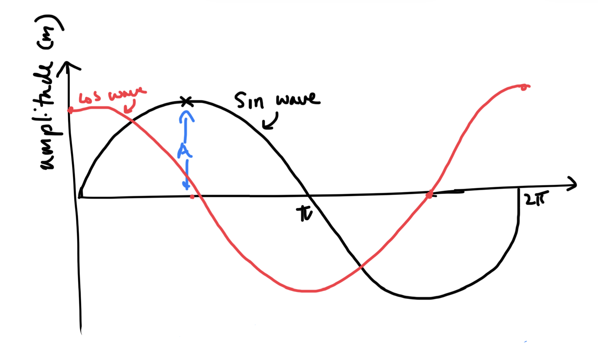

1.  What is a sinusoid ?\
    A sinosoid is a harmonic wave that moves in a periodic manner with smooth edges and oscilates between a baseline.

    <https://www.sciencedirect.com/topics/chemistry/sinusoidal-wave>

2.  What (simple) physical phenomenon produces a sinusoid?.\
    A tuning fork has the ability to create pure tones (sinus waves)

3.  Draw a diagram of a sine curve as a function of time

    

4.  What is the equation of a sinusoid?

    {width="199" height="37"}\
    t = time (Seconds)

    A = Amplitude (the peak Deviatiton from zero)

    ϕ = Initial phase angle (radians, rad)

5.  Define (in plain English + give unit) and illustrate (on the diagram):

    \
    frequency - oscillations per given time (Hz)\
    period - time taken for one oscillation (Seconds)\
    amplitude - Peak deviation from the baseline (Meters)\
    pulsation/ angular frequency - the speed of the wave (rad/s)

    <https://www.electronics-tutorials.ws/accircuits/sine-wave.html>

6.  What is the difference between a sine and a cosine?

    The core difference between a sine wave and a cosine wave is their starting position at x=0, also known as their phase. Both functions share the exact same shape, period (2π radians), and amplitude range (from −1 to 1), but cosine is simply a sine wave shifted horizontally.

    ycosine​(t)=Acos(ωt)\
    

    Gemini:" what is the difference between sin wave and cos wave. please provide the functions"

7.  Explain why a sinusoid is a periodic signal

    A sinusoid is periodic because it repeats its values continuously at regular time intervals T

    <https://eng.libretexts.org/Bookshelves/Electrical_Engineering/Signal_Processing_and_Modeling/Signals_and_Systems_(Baraniuk_et_al.)/06%3A_Continuous_Time_Fourier_Series_(CTFS)/6.01%3A_Continuous_Time_Periodic_Signals>

8.  Explain why a sinusoid is a continuous signal

    Because it is defined smoothly across all real-valued time points without sudden breaks or step changes

9.  Explain why a sinusoid is a parametric signal, and with which parameters

    Because its full mathematical form is completely governed by three explicit parameters: amplitude, frequency, and phase shift

    gemini:"Explain why a sinusoid is a parametric signal, and with which parameters"

10. Provide at least 3 URL and 3 references to books or scientific papers that you have used to answer the previous questions

    1.  <https://www.electronics-tutorials.ws/accircuits/sine-wave.html>

    2.  <https://www.sciencedirect.com/topics/chemistry/sinusoidal-wave>

    3.  <https://en.wikipedia.org/wiki/Sine_and_cosine>

    4.  <https://en.wikipedia.org/wiki/Sine_wave>

    5.  <https://eng.libretexts.org/Bookshelves/Electrical_Engineering/Signal_Processing_and_Modeling/Signals_and_Systems_(Baraniuk_et_al.)/06%3A_Continuous_Time_Fourier_Series_(CTFS)/6.01%3A_Continuous_Time_Periodic_Signals>

11. Provide the time you spent on this assignment - 2.5 hours
